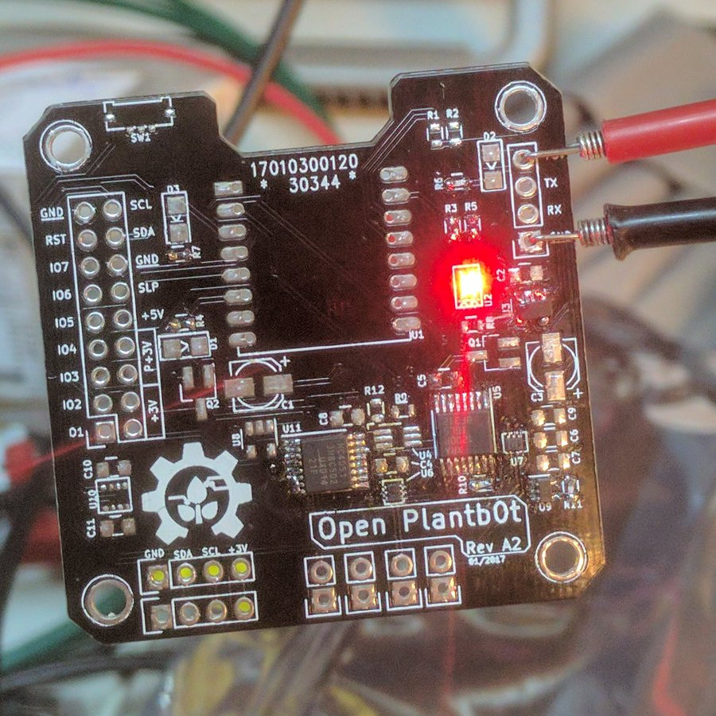
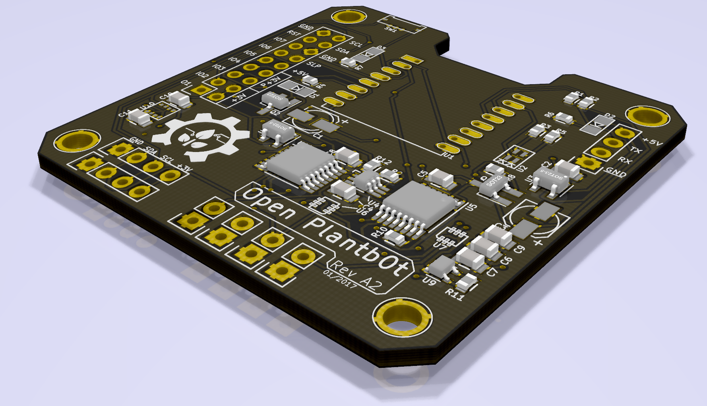
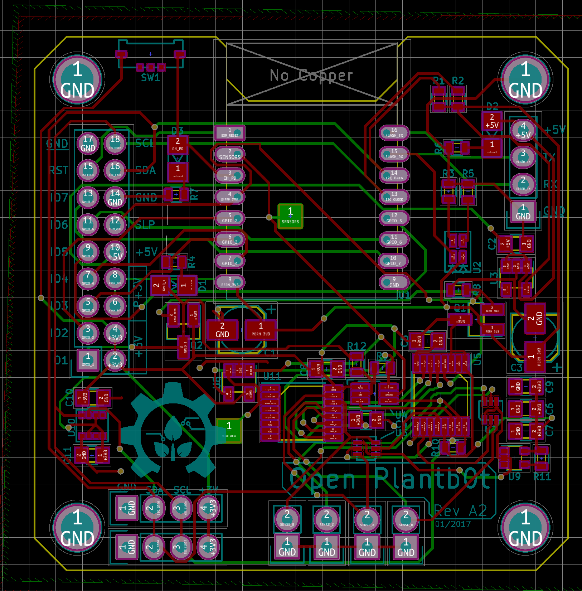

# Open Plantb0t

Because growing plants is hard work and nobody ain't got no time for that anymore. This project was started after I managed to kill a plant my mother got me for my birthday last year because it was "unkillable". Ha.

This project aims to build an open source tool that provides environmental sensors for regular house plants as well as hydroponic systems.

Monitoring can either be done locally or via a "cloud" or not at all with add-on ports for pumps and future expansions (or your own?).

The goal is to eventually provide a block-based programming interface so that even people who don't enjoy writing C code (tzzz...who doesn't? :P) can customise their plantbot to do what they want.

### Current specs

Here is a list of current specs with notes about how they integrate/ work

1x Wifi enabled microprocessor

 - Can be programmed via RX/TX serial lines
 - USB/ OTA programming will be added later

4x Analog sensor mounts (for temperature, soil moisture, light, ...)

 - Variable gain amplifier can be used on a per-channel basis
 - Signal offset results in optimal reading per sensor type
 
2x I²C expansion ports for additional sensors or expansions

16-pin shield header for user (or future) expansion boards

Low-power sleep mode for the entire board/ expansion circuitry

### Current state

The board was re-designed recently in Rev A2. Prototypes were ordered and partially assembled. Further testing on the board layout and circuit design needs to be performed.

The firmware is largely unwritten.

Following are some pictures. Enjoy :)

