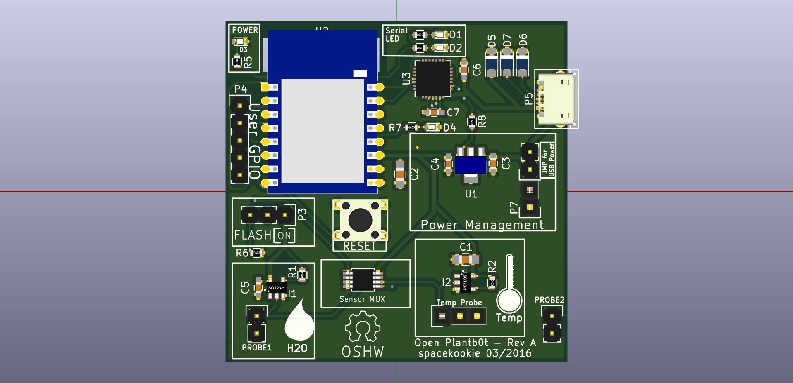
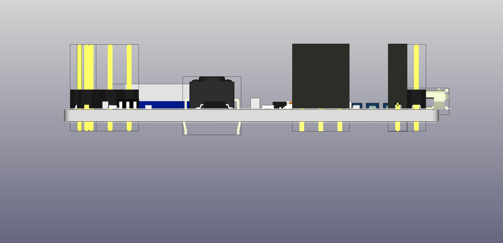
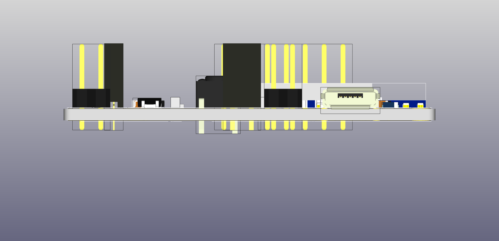
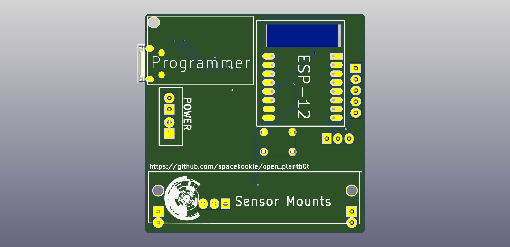
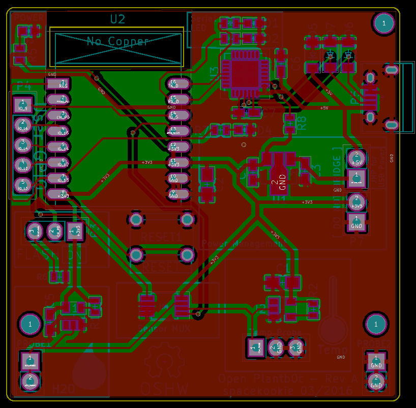

# Open Flowerb0t

An ESP8266 powered water sensors for your house plants & hydroponic systems. This board is currently still in heavy development. So please beware. Follow my blog [here](https://spacekookie.de/blog/) for details.

## Partlist

Here is a list of parts (including quantities) that you need to build your Plantb0t. This is only for Revision A.

 - ESP-12MOD (1x)
 - CP2102 - CP2102-GM (1x)
 - Zener-Diode (x3)
 - Constant Current Source - PSSI2021SAY (2x)
 - 3.3V Voltage Reg - LM2937IMP-3.3/NOPB (1x)
 - RTD Sensor - TD5A (1x)
 - Analog MUX - 74LVC1G53DC (1x)
 - SMD LED - KPT-3216EC (4x)

All parts bought in single neccessary values on element14 were like...10 bucks?

Updates about this project will follow soooon! 

## Some dynamic renders

**From the front**

**From the bottom**

**From the side**

**From the back**

**Here a picture of the board not rendered**

